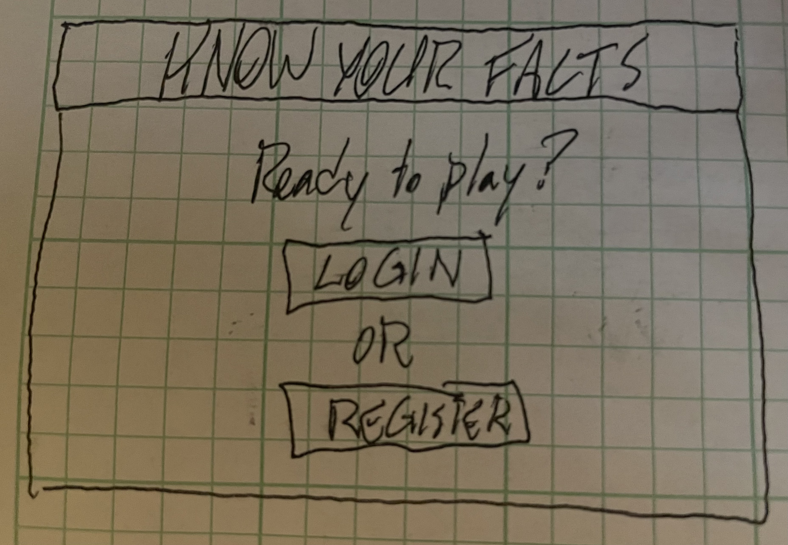
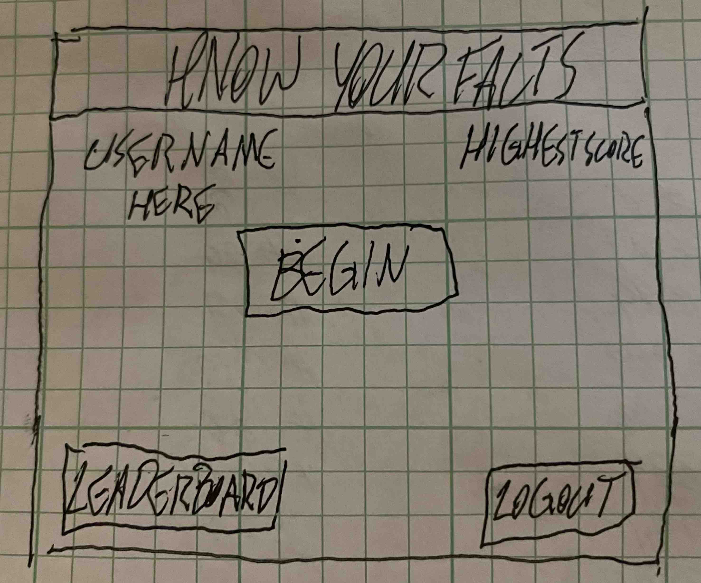
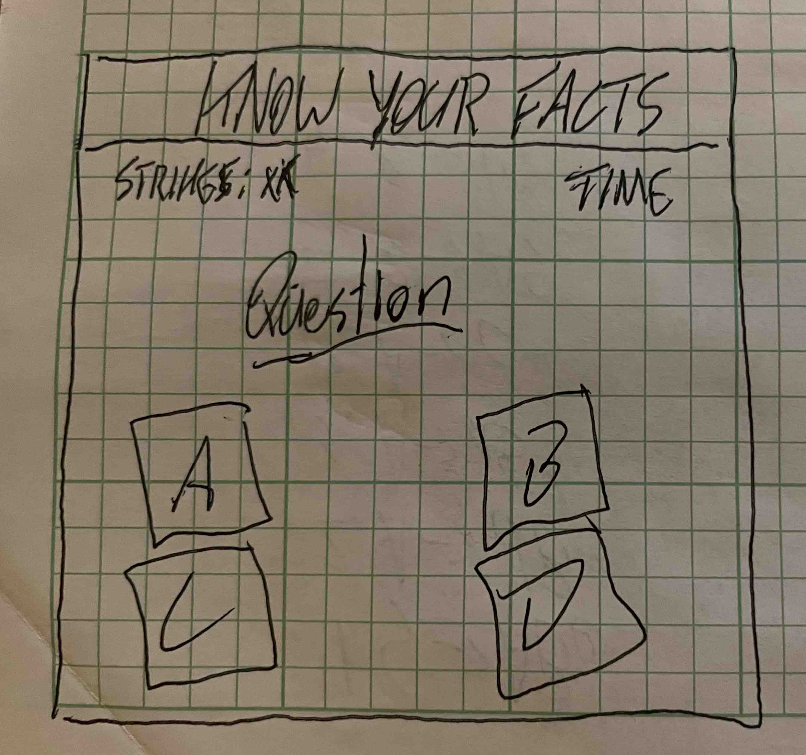

# startup pitch

## Know Your Facts Quiz

Have you ever debated with your friends about who knows the most random fun facts? The Know Your Facts Quiz makes it so anyone in the world can make compete to see how much they know. The quiz consists of 100 randomized questions, each with 4 possible answers. Each player has to answers as many correctly, as fast as possible. Each user gets 2 strikes before losing the game. Each player is also timed to see how long it takes them to answer the questions correctly. Once they finish their run, their score is posted to the global leaderboard and they are ranked based on time and amount answered. Users also have the ability to friend other players and be notified what their friends score when they play and when their friends beat their high score. 

#### Login Page

#### Home Page

#### Quiz Page 

#### Leaderboard Page 

### Key Features 
- Secure Login over HTTPS
- Questions pulled from stored database and randomized
- Timer run and time stored to be associated with the logged in user and which attempt it was
- App keeps track of user attempts 
- App keeps track of of missed questions and ends the game after two failures
- App creates global leaderboard and calculates positions based on time and number of questions answered 
- All users can view the global leaderboard
- Users have the ability to friend each other and receive notifications about each other's game progress 

## Things Learned from Simon
- A cloud server can only handle so much space taken up by images. It's smart to re-size and reduce resolution before uploading.
- New HTML commands learned: inserting break line, inserting TM symbol, Making a column head on a table
- Formatting is most likely going to change during creation as you have new ideas and introduce new CSS and JS code. That's good!
- Bootstrap is actually really useful and makes a website look slick, it just takes time to learn all the nuances of it and the different classes available 
- I learned of the usefulness of using flex and its different variables to arrange a website. Big fan of justify content and align items, makes things pretty.
- Making a website slick takes a lot of effort and skill. It takes a lot to manipulate CSS to look modern and good, and right now my skills with it are ok, but I think I just need more practice to make better looking websites.
- I've learned how I am going to store and arrnage scores for display in my startup project from this project, so that's super nice.
- JS is super complicated it what I got from this project, but at the same time fairly intuitative, especially with VScode helping out by suggesting commands and functions.
- I also learned it is easier to split up JS into different files based on which HTML they are associated with, making easier to manage.
- I learned more about appendChild using the DOM and am excited to try this one out.

## Things Learned from Startup
- It's tricky to line up things to look the way you want them to on a website. You sometimes have conflicting CSS classes and rules, so you need to make sure everything is cleary defined. It helps to divide the webpage by div and section attributes then makes specific classes for each attribute.  
- w3schools is the way to go
- CSS is super complex, especially to get things lined up the desired way
- using specific selectors, such as inheritance making it a bit easier to divide and specify individual CSS rules
- trying out flex on the game.html webpage and it seems to be working well, especially using the em rule to indicate width and height then wrap-around to make the 4 input options line-up
- rely on percentages and em to dictate where an item is located on the screen, using px to hard-code makes it look funky where switching screen size
- addEventListener to have JS run when certain events happen
- 'DOMContentLoaded' is useful for when screen loads
- document.getElementByID and ClassName are super helpful 
- setInterval and clearInterval can be used to count things at a set pace