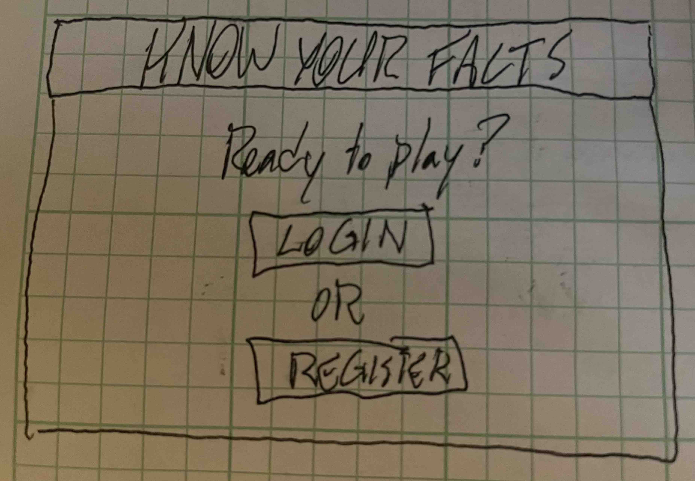
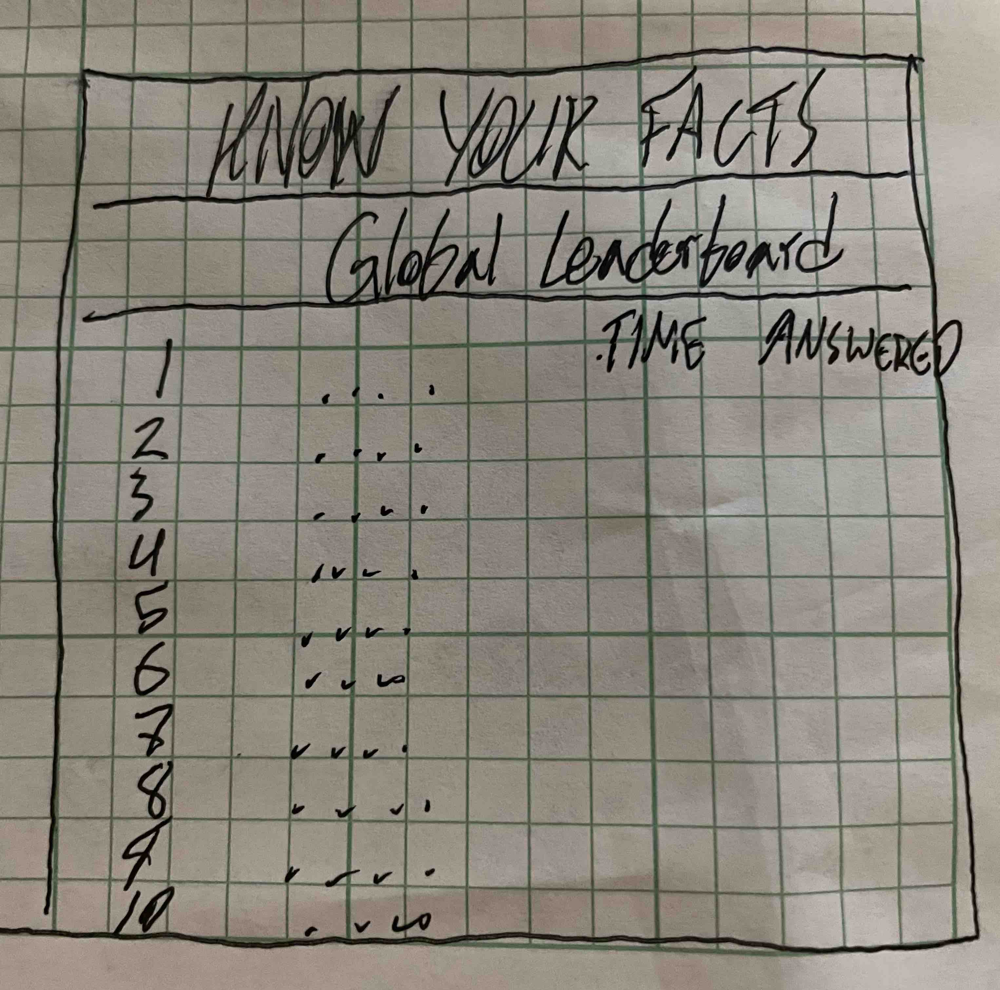

# startup pitch

## Know Your Facts Quiz

Have you ever debated with your friends about who knows the most random fun facts? The Know Your Facts Quiz makes it so anyone in the world can make compete to see how much they know. The quiz consists of 100 randomized questions, each with 4 possible answers. Each player has to answers as many correctly, as fast as possible. Each user gets 2 strikes before losing the game. Each player is also timed to see how long it takes them to answer the questions correctly. Once they finish their run, their score is posted to the global leaderboard and they are ranked based on time and amount answered. Users also have the ability to friend other players and be notified what their friends score when they play and when their friends beat their high score. 

#### Login Page

#### Home Page

#### Quiz Page 

#### Leaderboard Page 

### Key Features 
- Secure Login over HTTPS
- Questions pulled from stored database and randomized
- Timer run and time stored to be associated with the logged in user and which attempt it was
- App keeps track of user attempts 
- App keeps track of of missed questions and ends the game after two failures
- App creates global leaderboard and calculates positions based on time and number of questions answered 
- All users can view the global leaderboard
- Users have the ability to friend each other and receive notifications about each other's game progress 

## Things Learned from Simon
- A cloud server can only handle so much space taken up by images. It's smart to re-size and reduce resolution before uploading.
- New HTML commands learned: 
, , <th>
- Formatting is most likely going to change during creation as you have new ideas and introduce new CSS and JS code. That's good!
