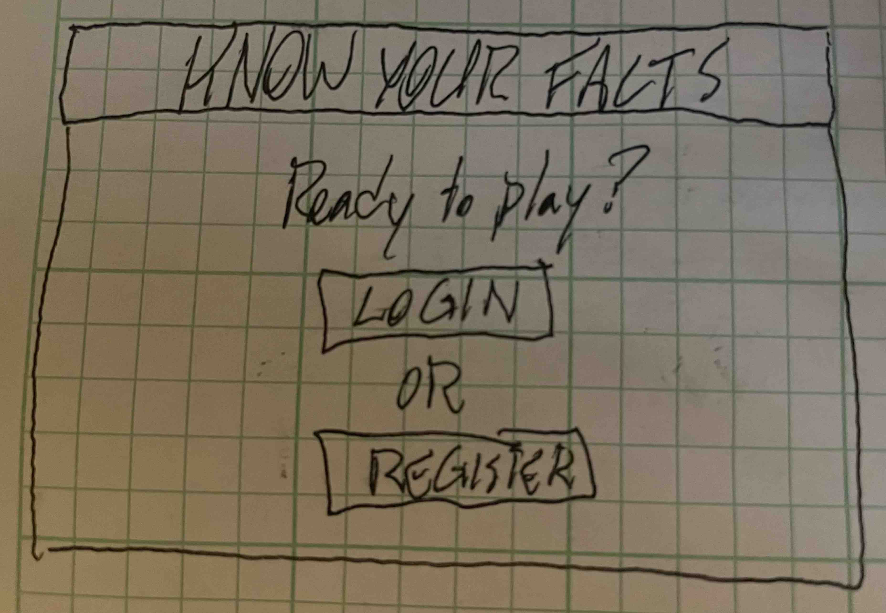
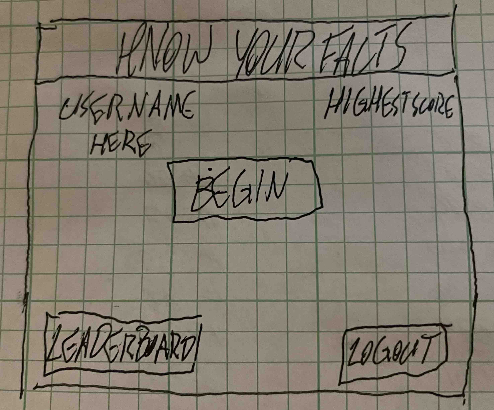
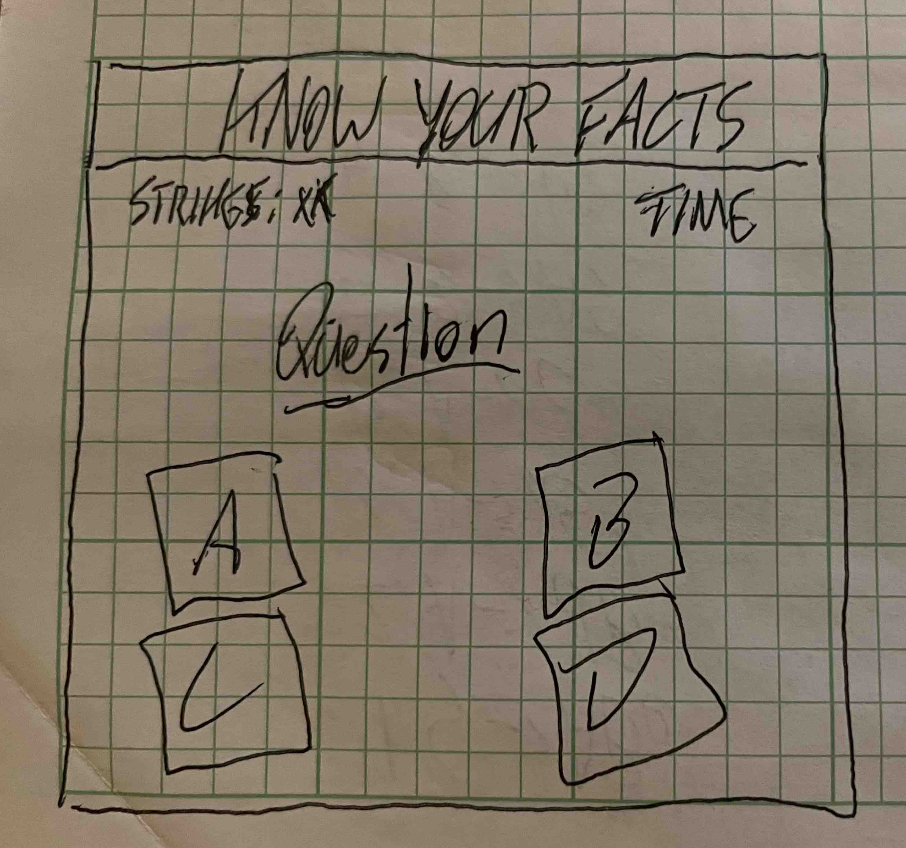
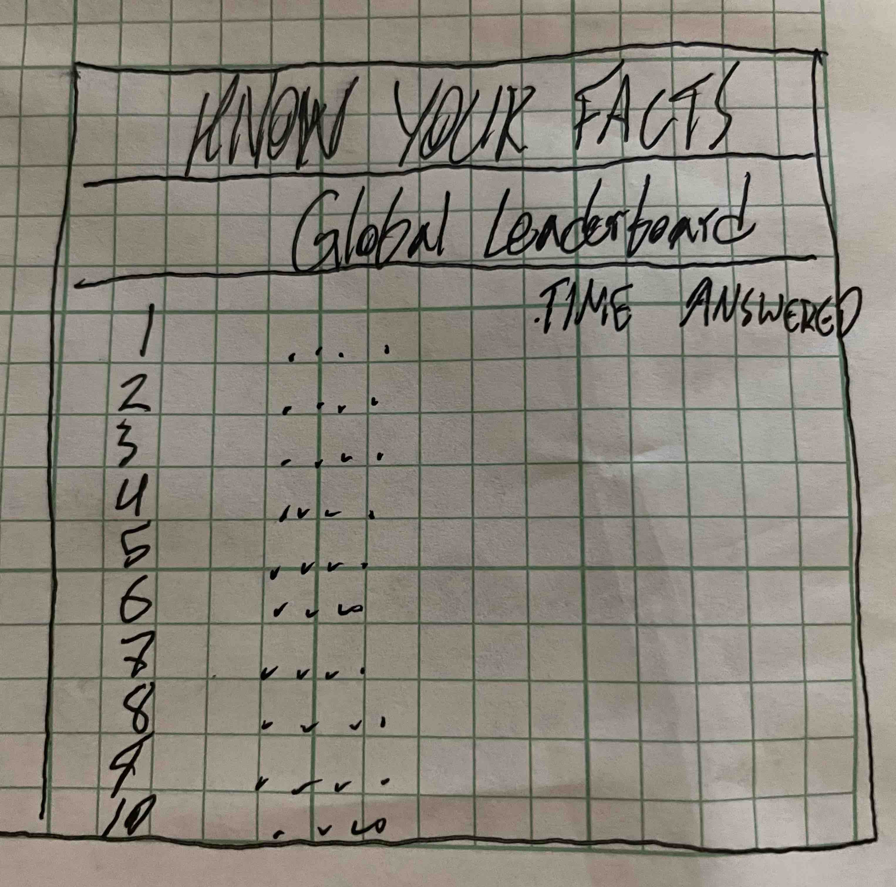

# startup pitch

## Know Your Facts Quiz

Have you ever debated with your friends about who knows the most random fun facts? The Know Your Facts Quiz makes it so anyone in the world can make compete to see how much they know. The quiz consists of 100 randomized questions, each with 4 possible answers. Each player has to answers as many correctly, as fast as possible. Each user gets 2 strikes before losing the game. Each player is also timed to see how long it takes them to answer the questions correctly. Once they finish their run, their score is posted to the global leaderboard and they are ranked based on time and amount answered. Users also have the ability to friend other players and be notified what their friends score when they play and when their friends beat their high score. 

#### Login Page

#### Home Page

#### Quiz Page 

#### Leaderboard Page 

### Key Features 
- Secure Login over HTTPS
- Questions pulled from stored database and randomized
- Timer run and time stored to be associated with the logged in user and which attempt it was
- App keeps track of user attempts 
- App keeps track of of missed questions and ends the game after two failures
- App creates global leaderboard and calculates positions based on time and number of questions answered 
- All users can view the global leaderboard
- Users have the ability to friend each other and receive notifications about each other's game progress 

## Things Learned from Simon
- A cloud server can only handle so much space taken up by images. It's smart to re-size and reduce resolution before uploading.
- New HTML commands learned: inserting break line, inserting TM symbol, Making a column head on a table
- Formatting is most likely going to change during creation as you have new ideas and introduce new CSS and JS code. That's good!
- Bootstrap is actually really useful and makes a website look slick, it just takes time to learn all the nuances of it and the different classes available 
- I learned of the usefulness of using flex and its different variables to arrange a website. Big fan of justify content and align items, makes things pretty.
- Making a website slick takes a lot of effort and skill. It takes a lot to manipulate CSS to look modern and good, and right now my skills with it are ok, but I think I just need more practice to make better looking websites.
- I've learned how I am going to store and arrnage scores for display in my startup project from this project, so that's super nice.
- JS is super complicated it what I got from this project, but at the same time fairly intuitative, especially with VScode helping out by suggesting commands and functions.
- I also learned it is easier to split up JS into different files based on which HTML they are associated with, making easier to manage.
- I learned more about appendChild using the DOM and am excited to try this one out.
- learned the different ways to implement an API http request(get, post, delete, etc)
- learned how to implement express in node JS and tie to the public folder 
- make sure to create an API router through which all requests go
- make sure to define each endpoint desired for the service 
- my startup will use, create user, login, logout, create score, and get scores 
- make sure to assign a static port when the website runs multiple programs, such as Simon and the startup
- make sure to write down the Atlas login credentials correctly in the env file, else you're gonna have issues 
- can use the MongoDB manual to learn how to make specific queries and sort data
- unable to view data in MongoDB, but it returns stil?
- whenever changes are made to how Mongo is accessed, restart the service to push the updates through 
- manipulate the cookie to control user authentication, utilizing settings such as secure, http, and sameSite.
- it's not too hard to setup websockets for a website. You just need to establish a connection then have the ability to open, close, and pong the connection
    - after that it's just doing whatever you want with the desired information from the connection
- make the functions that deal with the websockets asynchronous 
- React is kinda confusing - but it reminds me of Vue.js in its setup
- I like we can separate functions into different jsx files for ease and organization then call all the functions into the main file
- It looks like I can keep my functions mostly the same and what I'll need to change is the html and display capabilities.

## Things Learned from Startup
- It's tricky to line up things to look the way you want them to on a website. You sometimes have conflicting CSS classes and rules, so you need to make sure everything is cleary defined. It helps to divide the webpage by div and section attributes then makes specific classes for each attribute.  
- w3schools is the way to go
- CSS is super complex, especially to get things lined up the desired way
- using specific selectors, such as inheritance making it a bit easier to divide and specify individual CSS rules
- trying out flex on the game.html webpage and it seems to be working well, especially using the em rule to indicate width and height then wrap-around to make the 4 input options line-up
- rely on percentages and em to dictate where an item is located on the screen, using px to hard-code makes it look funky where switching screen size
- addEventListener to have JS run when certain events happen
- 'DOMContentLoaded' is useful for when screen loads
- document.getElementByID and ClassName are super helpful 
- setInterval and clearInterval can be used to count things at a set pace
- setTimeout is super useful to delay actions and functions from taking place immediately with JS
- the forEach loop is useful to go through the elements in an array and do things to each individual one
- You can only uncheck radio buttons using JS, cannot be done with HTML or CSS
- Split JS into different files when you can, makes everything cleaner
- the for loop is extremely useful to go through all the variables of an array- ex: "for (const [i, score] of scores.entries())" to go through the stored scores
- compare scores by names to find a user's score
- createElement and appendChild of the DOM is useful for table situations 
- make sure to update parameters of code as you are testing and increasing the question capacity - such as increasing index capacity of shuffledQuestions() and nextQuestions()
- you can turn a string into a number by adding a + symbol to the front. Example: min = "24" and +min = 24
- make sure to use PM2 to configure the web service to use node and host the web service
- use PM2 ls to look at the different sessions
- can sort integers in MongoDB through a query that looks like this: sort: {score: -1, minutes: 1}
    - the -1 means descending order and +1 means ascending order
- you can use ${} to embed code into html to reduce number of functions by providing different variables to the function based on what you want done
- restart the service everytime something in the server.js or databse.js file is changed to ensure they are pushed through 
- use console.log to print out as much as possible when errors are occuring to help discover what the issue is
- window.onload is not an asyncrohonous function!
- makes sure the websocket is fully loaded and established before trying to send messages across, so either call it in a different function or make it asyncrohonous so no errors occur
- you can use webSocket calls across JS files as they can use the data provided by the pong